# Xplorio

**Explorer for Volumio**: (re)discover your own music collection.

[Deutsche Fassung](README.md) · [What is Xplorio?](docs/xplorio_en.md)

Xplorio is a custom web interface for Volumio 2 (built for a Musical Fidelity MX-Stream, Raspberry Pi CM3), running directly in the browser without a build step.
It also runs on Volumio 4 (for differences, see [Setup](docs/setup.md#volumio-4)). It probably runs on Volumio 3 as well, but this has not been tested. In addition to the files that run on the player, the repository only contains tests (`tests/`) and the setup documentation;
`xplorio-deploy` deploys only the runtime files.

  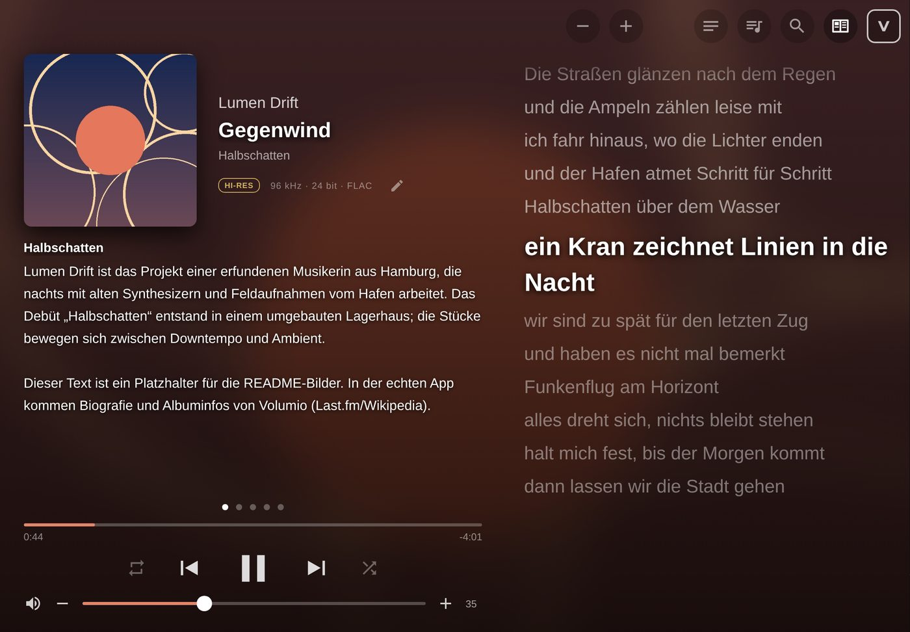

All images in this file show a fictional example library in German language setting (artists, cover art, and texts are made up). They do not always show the latest state of development, so some features have been moved or added since the screenshots were taken.

Developed using AI (Claude code https://claude.ai)

## Features

### Playback, Lyrics, and Information

Large cover art, track and album information, badges for audio quality (Hi-Res, sample rate, bit depth, format), progress,
volume, and the usual controls. The background color and accent are derived from the cover art. Lyrics are synchronized
(lrclib.net); if the lyrics do not perfectly match the recording, "−" and "+" shift them in 0.5-second increments, and the
offset then applies to that track on all devices. The information page shows the album, artist, contributors, and which
releases by that artist are available in the collection. Tapping a linked contributor (person, studio, label) expands
its own information right below. If Volumio does not provide album or artist information
(Volumio 4 only provides it with a subscription), the app retrieves it from Last.fm or Wikipedia. If one of them has a text about the current track (usually for
singles), an extra "Track" tab appears.

  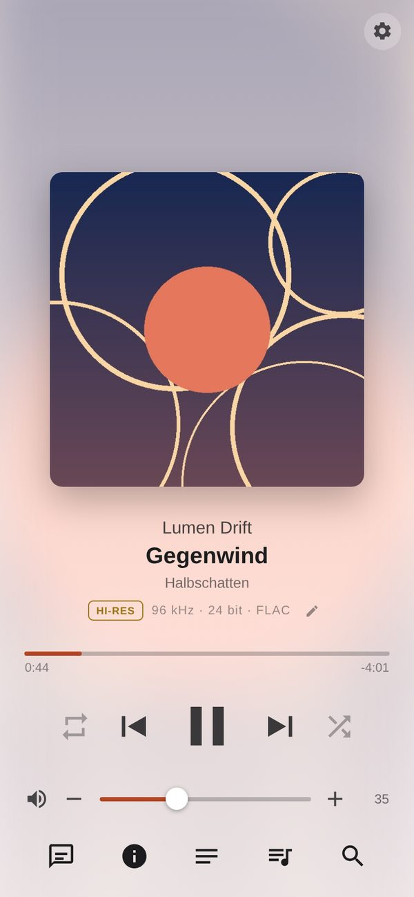
  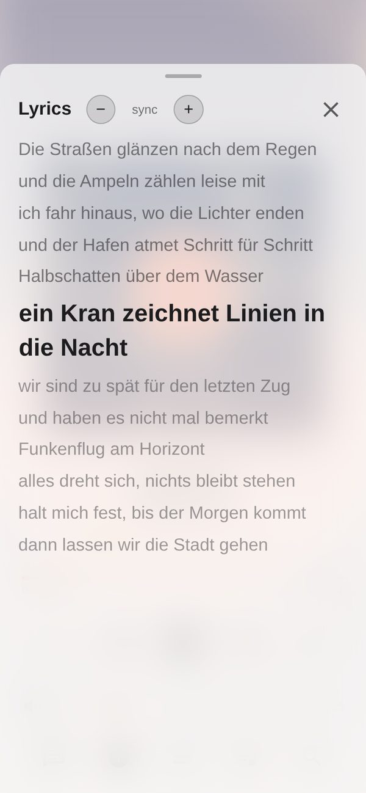
  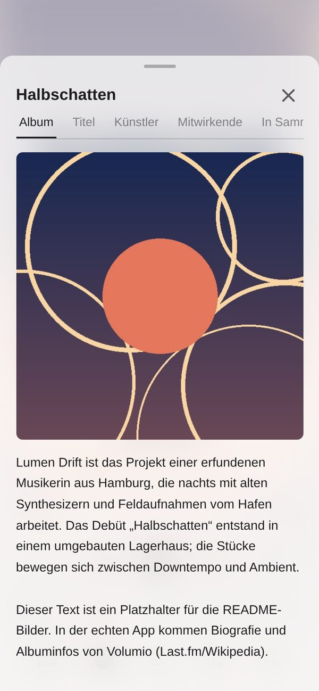
  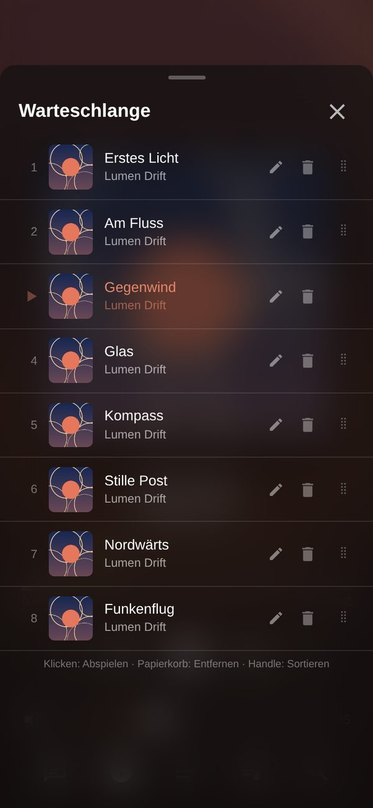

### Display Layout for iPad, Desktop, and TV

On large screens, cover art, information, and controls are displayed on the left, with lyrics on the right; the information
automatically cycles through the available pages. Switch using the control at the top right or with `?layout=stage`.
`kioskTV.html` is a display-only interface for a TV connected to the audio system, without controls.

  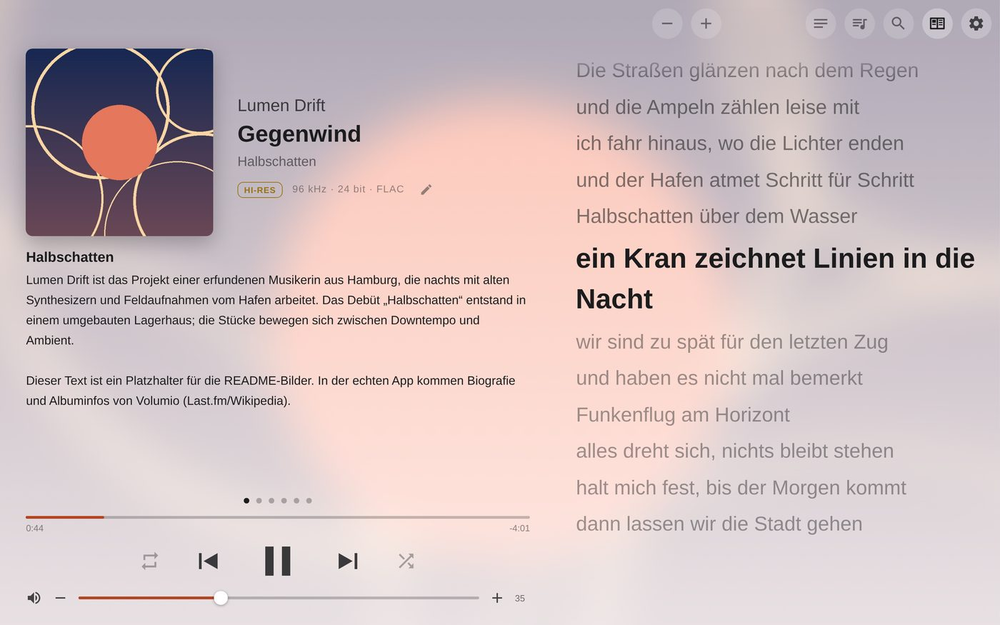
  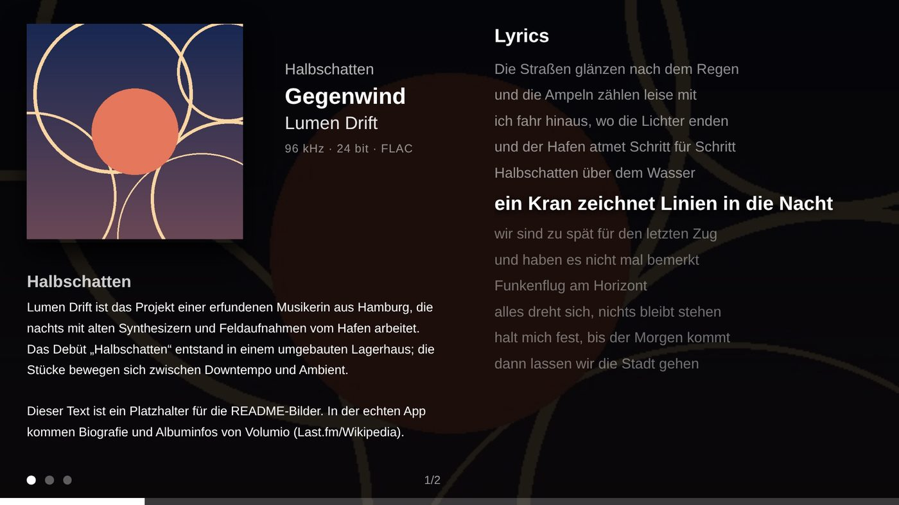

### Search & Discover

Search finds artists, albums, tracks, and genres (per genre the styles from the audio analysis and all albums) in the local library and on the streaming services configured in Volumio
(TIDAL, Qobuz, HIGHRESAUDIO, Spotify (not tested yet)), each in separate sections with checkboxes for showing or hiding them. As long as
nothing has been entered, the selected tab shows rows to discover: random discoveries, hidden gems (rarely played music that matches your ratings), played a year ago, not heard in a
while, never heard, and once played a lot. Below them, buttons lead on by mood, energy, style and decade. Next to "Play all" and on every Discover row, a dice starts a random mix of 25 tracks. On every artist page, the "Discover" tab leads to similar artists (with a random mix from them), the artist's moods, styles and decades; on every album page to similar albums, mood, style, year and more albums by the artist. The "Background" tab there shows the artist or album text and the credits. Tapping the current title shows similar tracks by mood, energy and tempo. Every album title shows its release year; tapping it opens that year's albums with suggestions from the decade.
Ratings: a heart for artists, one to five stars for albums, thumbs up or down for tracks (thumbs up is the Volumio favourite). For web radio, the app retrieves cover art for the currently playing
track and displays station logos in the station list.

  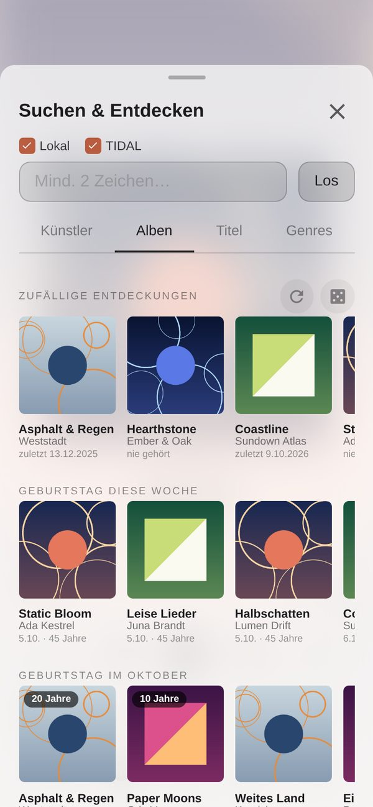
  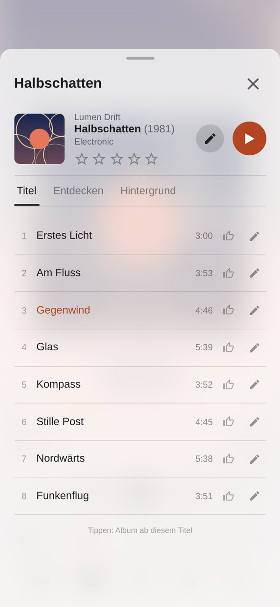
  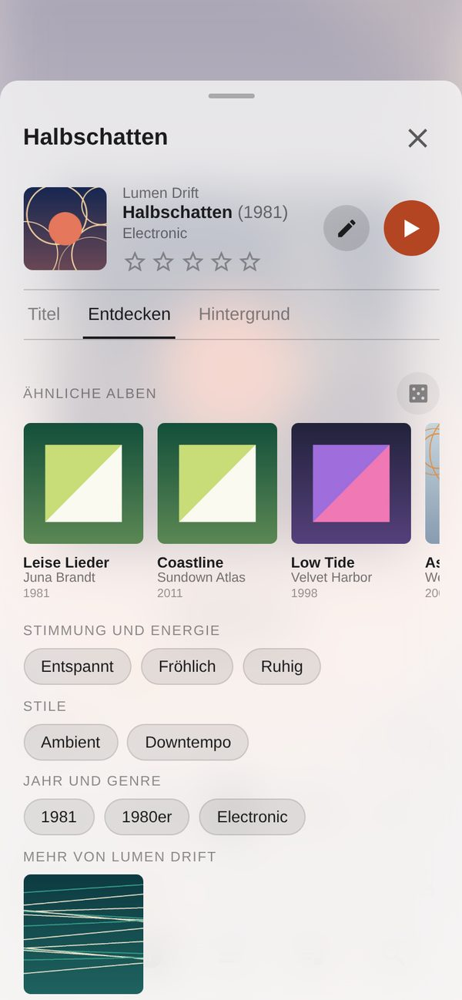

### Mood Mix

A dedicated first tab next to Playlists and Radio (playlist button). Select one or more moods, narrow down the energy level
from calm to high energy, limit it to genres, and under "Fine-tuning" choose styles, mix length, and discovery level: favorites, balanced, or
hidden gems, based on your listening history. "Create mix" first displays a preview with the reason for each track;
individual tracks can be removed or the mix can be reshuffled. Only "Play mix" replaces the queue.

The mix is based on Last.fm tags for each track, which the Tag Service collects while nothing is playing; the music files
remain unchanged. Optionally, Essentia on the Mac can analyze each track directly (`tools/essentia/`): in that case,
energy and mood are derived from the audio, and a tempo control (BPM) is added.

  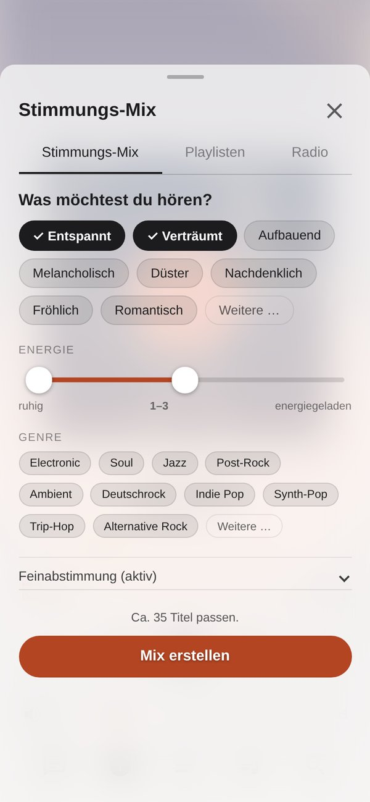
  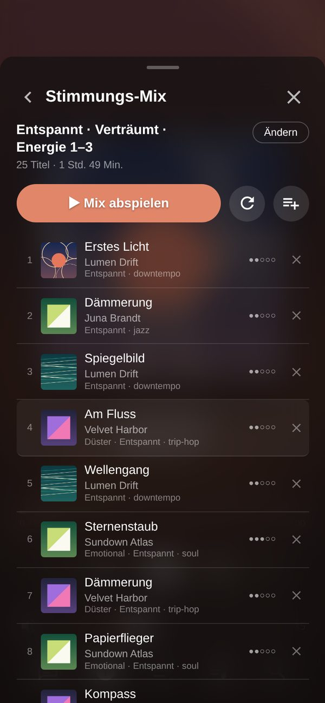

### History, Statistics, and Review

The Tag Service records what is played and can scrobble to Last.fm as well as import the existing Last.fm listening history.
This data is used to provide "Recent", rankings (tracks, albums, artists, genres), statistics by day, time of day,
weekday, and genre, and an annual review with a comparison to the previous year, top genres, and newly discovered artists.
Tapping a month displays the rankings for that month.

  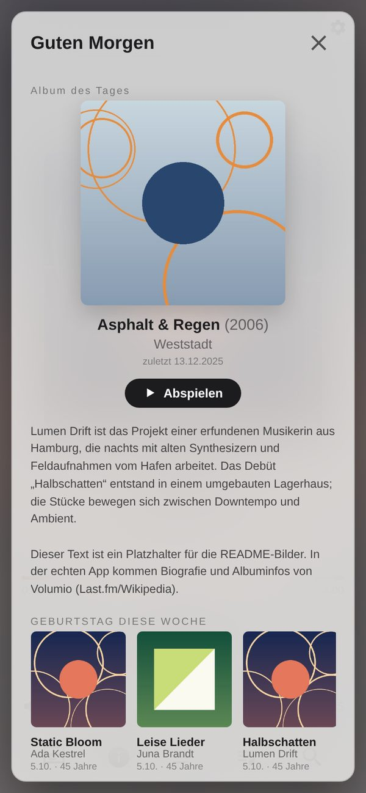
  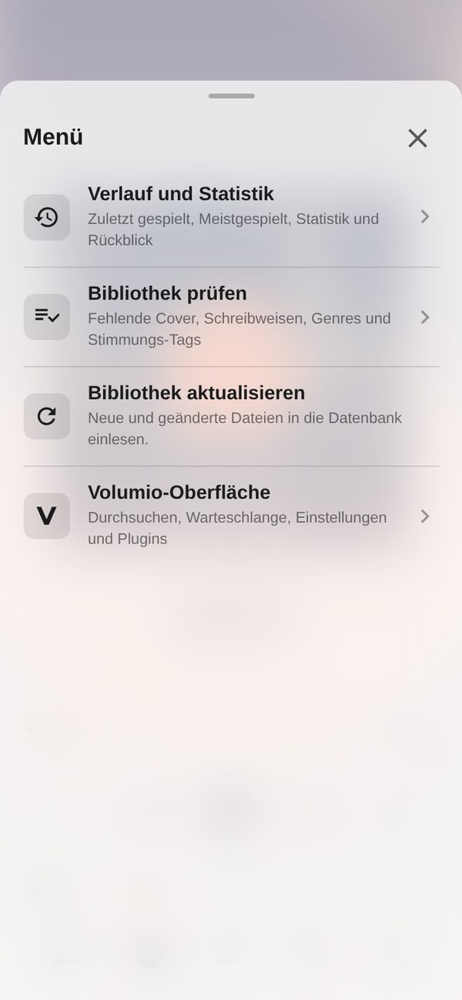
  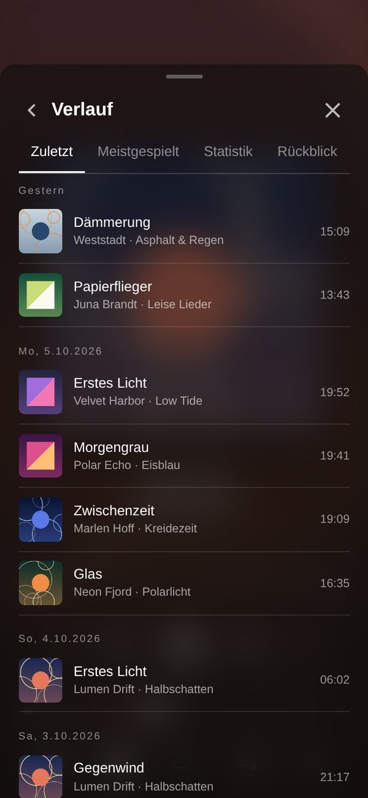
  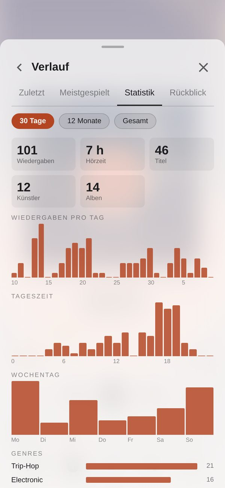
  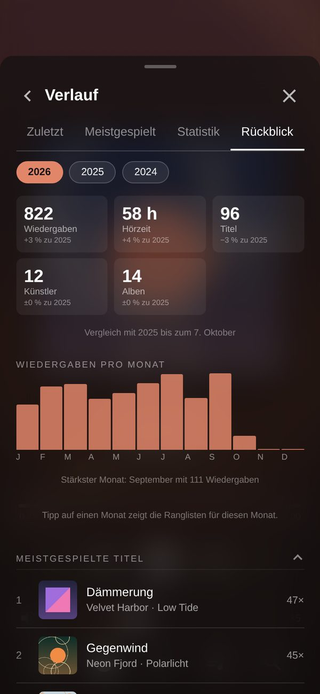

### Tag Editor and “Check library”

Edit tags for individual tracks, entire albums, or all tracks by an artist, with text functions such as upper/lowercase
conversion, Undo, and cover art options (choose a file, search online, save embedded cover art as `folder.jpg`). “Check library” in the menu finds
albums without cover art, missing or inconsistent album artists, artists with multiple spellings, inconsistent
album names or years, tracks without track numbers and release dates that differ from MusicBrainz, and suggests one genre per album (Discogs top categories, from
existing genre tags and the audio analysis); each entry opens the appropriate editor directly and then stays greyed out until the next check. It also shows the
progress of the mood tags.

  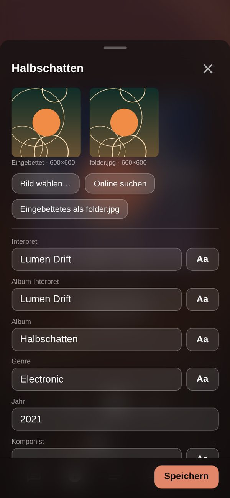
  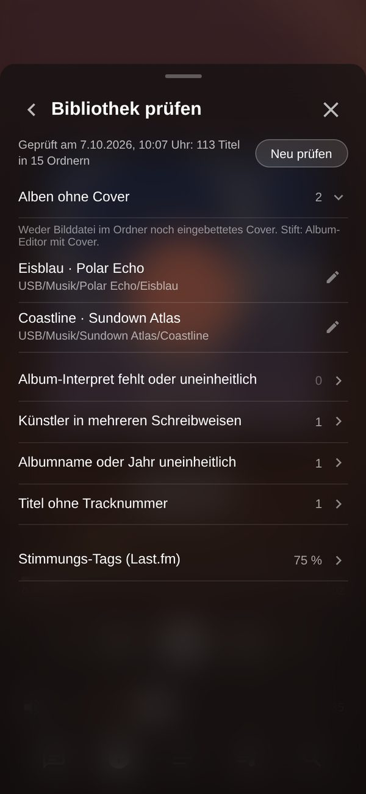
  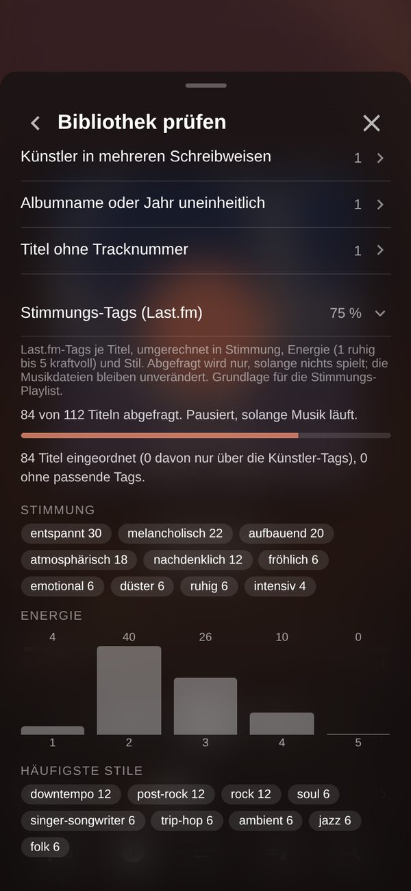

### More

- Welcome screen on opening: album of the day, album birthdays (round ones and anniversaries highlighted), recently
  played and new albums, random mix; birthdays, recently played and new also in Discover.
- Menu behind the gear at the top right: welcome screen, history and stats, check library, system (CPU load, temperature, memory, drives, services with restart), update library, and the original Volumio
  interface (browse, queue, settings, plugins, system = Volumio's /dev page) and a help page on how to use the app; at the bottom the logo, the installed version and the license.
- Light and dark, following the device setting or set explicitly.
- German and English, following the Volumio language setting or set explicitly; further languages as a file in `web/lang/`
  (see [Setup](docs/setup.md#language)).
- Optional: control a network-connected Rotel amplifier (power, volume, input) via `rotel/rotel-bridge.js`.
- TIDAL Watchdog: reconnects TIDAL or restarts Volumio if the TIDAL plugin becomes unresponsive.
  (On my MX-Stream this happens due to a session timeout after about 4 hours without TIDAL use.)
- `xplorio-deploy`: updates the player directly from this repository, with backups and `--rollback`; the same on
  Volumio 3 and 4.

## Structure

| File / Folder | Contents | Location on the Player |
|---|---|---|
| `xplorio.html` + `web/` | Interface for phone, iPad, and desktop (playback, queue, local and streaming-service search, lyrics, information, Tag Editor, Mood Mix, history, display layout for large screens) | `/volumio/http/www3/` (Volumio 4: `www4/`) |
| `kioskTV.html` | Page for a kiosk display (cover art, track information, lyrics) | `/volumio/http/www*/` |
| `tags/` | Tag Service (port 8766): Tag Editor, Check library, history, mood tags, cover art; accepts commands only from the interface; Python 2.7 or 3 with bundled mutagen library (GPLv2, see `tags/vendor/mutagen/COPYING`) | `/data/xplorio/tags/` (data: `/data/xplorio/data/`) |
| `rotel/rotel-bridge.js` | optional: HTTP service (port 8765) for a network-connected Rotel amplifier (volume, power, input), interface only | `/data/xplorio/rotel/` |
| `tools/tidal-watchdog.sh`, `tools/tidal-reconnect.js` | restarts Volumio or reconnects TIDAL if the TIDAL plugin becomes unresponsive (tested only on Volumio 2) | `/volumio/http/www3/tools/` |
| `tools/xplorio-deploy.sh` | updates the player from this repository (`xplorio-deploy`) | `/usr/local/bin/` |
| `tools/essentia/` | optional audio analysis on the Mac; results are uploaded to the Tag Service | not on the player |

Requirements: Volumio 2 (Node 8, Python 2.7, `mpc`) or Volumio 4 (Node and Python 3 are included). Setup:
[docs/setup.md](docs/setup.md). Update directly on the player: `sudo xplorio-deploy`
(`tools/xplorio-deploy.sh`, see there).

The Rotel amplifier integration and the TIDAL watchdog are optional (see setup). Custom settings (language, Rotel, services on/off) belong in `web/config.local.js`
(template `web/config.local.js.example`); this file is not included in the repository. The Last.fm credentials (for similar artists,
mood tags, information texts, and scrobbling) live in `/data/xplorio/data/keys.json` and are read only by the Tag Service.

## Tests

`node tests/run-all.js` (Node 18 or newer, no dependencies; the Tag Service test additionally requires Python).

License: MIT (see `LICENSE`), except for the bundled library in `tags/vendor/mutagen/` (GPLv2 or later, separate `COPYING`).
Not included but used: Volumio (GPL-3.0) with socket.io (MIT) on the player, Essentia (AGPL-3.0) and its models
(CC BY-NC-SA 4.0, non-commercial only) in the analysis tool on the Mac. Data, covers, lyrics and station logos come from
Last.fm, MusicBrainz, Cover Art Archive, Deezer, iTunes, LRCLIB and radio-browser.info and are subject to their terms.
The menu shows this under "Third-party components and licenses".
